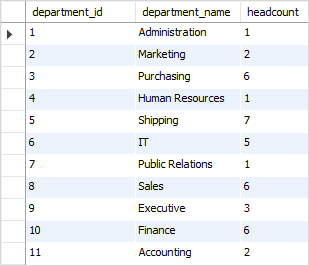

# GROUP BY

You often use the GROUP BY in conjunction with an aggregate function such as [MIN](http://www.sqltutorial.org/sql-aggregate-functions/sql-min/), [MAX](http://www.sqltutorial.org/sql-aggregate-functions/sql-max/), [AVG](http://www.sqltutorial.org/sql-aggregate-functions/sql-avg/), [SUM](http://www.sqltutorial.org/sql-aggregate-functions/sql-sum/), or [COUNT](http://www.sqltutorial.org/sql-aggregate-functions/sql-count/) to calculate a measure that provides the information for each group.

### Filtering

If you want to filter the rows **before grouping**, you add a [WHERE clause](http://www.sqltutorial.org/sql-where/). 

However, **to filter groups**, you use the [HAVING](http://www.sqltutorial.org/sql-having/) clause.

### Sorting

To sort the groups, you add the [ORDER BY](http://www.sqltutorial.org/sql-order-by/) clause after the GROUP BY clause.

### _grouping column and NULL_

The columns that appear in the GROUP BY clause are called _grouping columns_. If a grouping column contains [NULL](http://www.sqltutorial.org/sql-is-null/) values, all NULL values are summarized into a single group because the GROUP BY clause considers NULL values are equal.

## GROUP BY



```sql
SELECT
    department_id,
    COUNT(employee_id) headcount
FROM
    employees
GROUP BY
    department_id;
```







## GROUP BY with INNER JOIN



```sql
SELECT
    e.department_id,
    department_name,
    COUNT(employee_id) headcount
FROM
    employees e
        INNER JOIN departments d ON d.department_id = e.department_id
GROUP BY
    e.department_id;
```







## GROUP BY with ORDER BY



```sql
SELECT 
    e.department_id,
    department_name,
    COUNT(employee_id) headcount
FROM employees e INNER JOIN departments d 
ON d.department_id = e.department_id
GROUP BY e.department_id
ORDER BY headcount DESC;
```







## GROUP BY with HAVING



```sql
SELECT 
    e.department_id,
    department_name,
    COUNT(employee_id) headcount
FROM
    employees e
        INNER JOIN
    departments d ON d.department_id = e.department_id
GROUP BY e.department_id
HAVING headcount > 5
ORDER BY headcount DESC;
```







## GROUP BY with MIN, MAX, and AVG



```sql
SELECT 
    e.department_id,
    department_name,
    MIN(salary) min_salary,
    MAX(salary) max_salary,
    ROUND(AVG(salary), 2) average_salary
FROM
    employees e
        INNER JOIN
    departments d ON d.department_id = e.department_id
GROUP BY e.department_id;
```







## GROUP BY with SUM function



```sql
SELECT 
    e.department_id,
    department_name,
    SUM(salary) total_salary
FROM
    employees e
        INNER JOIN
    departments d ON d.department_id = e.department_id
GROUP BY e.department_id;
```







## GROUP BY multiple columns

So far, you have seen that we have grouped all employees by one column. 

* `GROUP BY department_id`place all rows with the same values in the `department_id` column in one group.

How about grouping employees by values in both `department_id` and `job_id` columns?

* `GROUP BY department_id, job_id` will group all employees with the same values in both `department_id` and `job_id`columns in one group.

The following statement 

* groups rows with the same values in both `department_id` and `job_id`columns in the same group 
* then returns the rows for each of these groups.
* The department 2, 3 and 5 appears more than one.
  * This is because these departments have employees who hold different jobs. 
  * For example, in the shipping department, there are 
    * 2 employees holding the shipping clerk job, 
    * 1 employee holding the stock clerk job, and 
    * 4 employees holding the stock manager job. 



```sql
SELECT 
    e.department_id,
    department_name,
    e.job_id,
    job_title,
    COUNT(employee_id)
FROM
    employees e
        INNER JOIN
    departments d ON d.department_id = e.department_id
        INNER JOIN
    jobs j ON j.job_id = e.job_id
GROUP BY e.department_id , e.job_id;
```







## GROUP BY and DISTINCT

If you use the `GROUP BY` clause without an aggregate function, the `GROUP BY` clause behaves like the [DISTINCT](http://www.sqltutorial.org/sql-distinct/) operator.

The following gets the phone numbers of employees and also group rows by the phone numbers. Notice that the phone numbers are sorted.



```sql
SELECT
    phone_number
FROM
    employees
GROUP BY
    phone_number;
```








